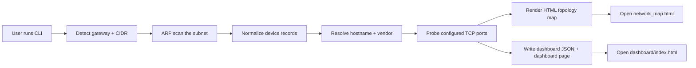

# Wi-Fi Network Map

[](https://github.com/Agape1211/Atuse/actions/workflows/ci.yml)
[](https://github.com/Agape1211/Atuse/releases)
[](https://github.com/Agape1211/Atuse/releases/latest)
[](https://www.python.org/)
[](LICENSE)
[](https://github.com/Agape1211/Atuse)

A Linux-first networking utility that discovers devices on your local network, identifies open TCP ports, and builds a live HTML topology dashboard.

## Why this project

This project turns a useful network-mapping idea into a practical, well-structured tool for home labs, small offices, and security-minded learning environments. It is designed to be readable, testable, extensible, and easy to run from the command line.

## Release notes

See [CHANGELOG.md](CHANGELOG.md) for version history and release updates.

## Features

- Discovers the default gateway and local subnet automatically
- Uses ARP scanning to find active devices on the LAN
- Resolves hostnames and MAC vendors for each device
- Scans common TCP ports to identify likely services
- Generates a topology map in HTML
- Produces a live dashboard JSON feed and refreshable dashboard page
- Supports JSON output for scripts and automation

## Installation

### Prerequisites

This project is designed for Linux systems with a working network interface and administrative privileges for ARP scanning.

Required tools:

- Python 3.10 or newer
- `ip` command from the `iproute2` package
- root or sudo privileges for ARP-based discovery on many systems
- an active network connection (Wi‑Fi or Ethernet)

### Install dependencies

Clone the repository and set up a virtual environment:

```bash
git clone https://github.com/Agape1211/Atuse.git
cd Atuse
python3 -m venv .venv
. .venv/bin/activate
python -m pip install --upgrade pip
python -m pip install -r requirements.txt
```

### Run the tool

```bash
python we547.py --help
```

You should see the available CLI options, including interface selection, CIDR scanning, dashboard output, and timeout configuration.

## Usage

### 1. Scan the active interface automatically

```bash
python we547.py --interface wlan0 --output network_map.html --dashboard-dir dashboard
```

This will:

- detect the default gateway for the chosen interface
- scan the network for active devices
- look up hostnames and vendors for each host
- probe common TCP ports
- generate an HTML topology map
- create a refreshable dashboard in `dashboard/`

### 2. Scan a specific subnet

```bash
python we547.py --cidr 192.168.1.0/24 --output network_map.html --dashboard-dir dashboard
```

### 3. Restrict the port list

```bash
python we547.py --interface wlan0 --ports "22,80-90,443" --dashboard-dir dashboard
```

### 4. Use a repeating refresh loop

```bash
python we547.py --interface wlan0 --dashboard-dir dashboard --refresh 15
```

This keeps scanning in a loop every 15 seconds and updates the dashboard feed.

### 5. Print JSON instead of text output

```bash
python we547.py --interface wlan0 --json
```

## Quickstart diagram



## What gets created

After a scan, the project generates these files:

- `network_map.html` — a visual network graph of discovered devices
- `dashboard/index.html` — a live dashboard page for viewing current results
- `dashboard/dashboard_data.json` — JSON summary that the dashboard reads

## Docker usage

Build the image:

```bash
docker build -t wifi-network-map .
```

Run it on the host network:

```bash
docker run --rm --net=host --privileged wifi-network-map --interface wlan0 --dashboard-dir /tmp/dashboard
```

## Typical output

```text
Gateway: 192.168.1.1
CIDR: 192.168.1.0/24
Discovered 6 devices
Map written to network_map.html
Dashboard assets written to /home/user/.../dashboard/index.html | /home/user/.../dashboard/dashboard_data.json
- 192.168.1.5 | printer | HP | ports: 80, 443
- 192.168.1.18 | nas | Synology | ports: 22, 80, 445
```

## Troubleshooting

### Permission denied

If you see a permission error, run the tool with sudo:

```bash
sudo python we547.py --interface wlan0
```

### No default route found

This happens when the machine is not connected to a network or the interface is not active.

Check:

```bash
ip route
```

### No devices found

Try verifying the interface and subnet:

```bash
ip addr show
python we547.py --cidr 192.168.1.0/24 --skip-ports
```

## Testing

Run the test suite:

```bash
pytest -q
```

## How it works for contributors

The project is intentionally small and layered so contributors can follow the flow quickly:

1. `gateway_and_cidr()` inspects the routing table and identifies the local network.
2. `scan_network()` sends ARP requests across the target CIDR and receives replies from live hosts.
3. `normalize_device()` standardizes each response into a consistent device object.
4. `detect_open_ports()` checks a configurable list of TCP ports to identify active services.
5. `render_network_map()` builds the topology graph with `pyvis`.
6. `build_dashboard_state()` creates the metrics summary used by the refreshable dashboard.
7. `main()` wires everything together through the CLI and handles argument validation.

If you are adding a feature, keep the workflow in this order: parse input, scan network, enrich data, render output, then expose it through the CLI.

## Production readiness checklist

- safe CLI validation for invalid ranges and negative refresh values
- versioned package metadata and release structure
- CI workflow for automated validation
- Dockerized runtime for simpler deployment
- test coverage around key networking logic

## Roadmap

- add passive discovery enhancements
- add service fingerprinting
- add export to JSON and CSV
- add richer visualization themes and filters
- add more device intelligence and event-driven refresh logic

## Contributing

Contributions are welcome. Please open an issue first for roadmap items or larger changes, then submit a pull request with a focused change.
# Atuse
